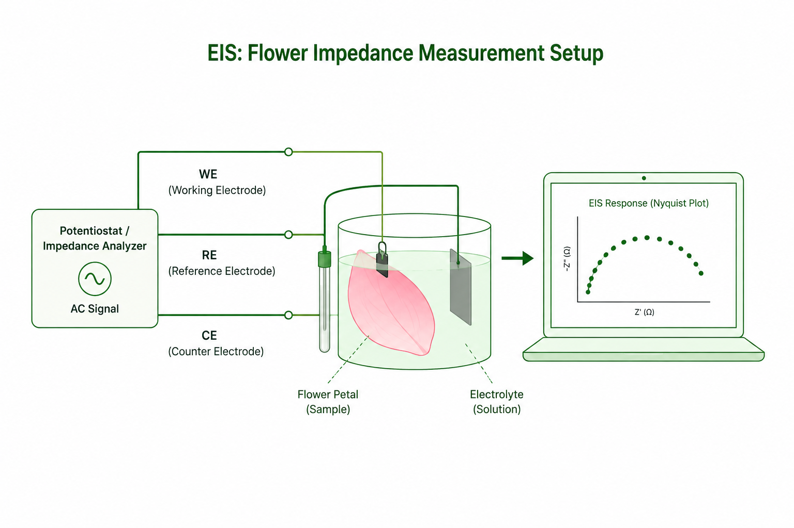
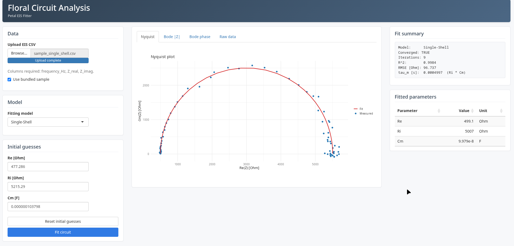
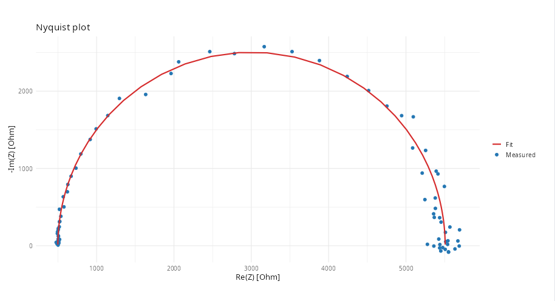
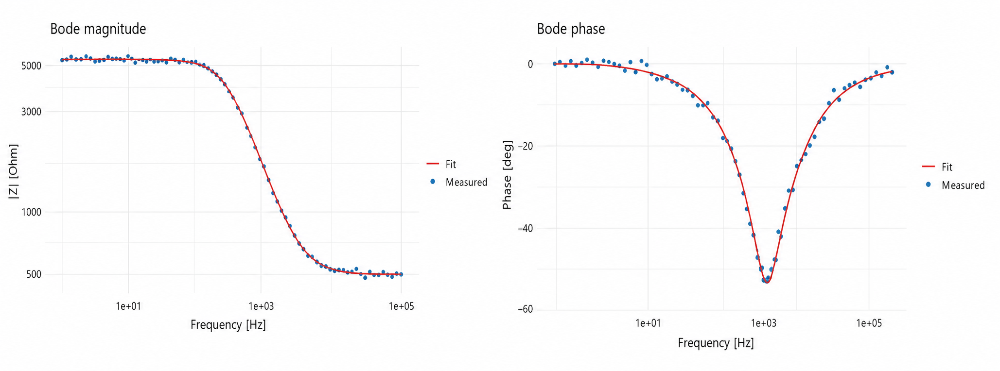

# Building FloraFit – My Journey into Flower Circuit Analysis

One of the things I enjoy most about research is that you never quite know where a conversation will lead.

A few weeks ago, my mentor introduced me to an area I had never explored before—**Electrochemical Impedance Spectroscopy (EIS)**. At first, it sounded like something far removed from software engineering. The idea of studying flower petals using electrical measurements wasn't something I had ever imagined.

As we discussed the research further, I learned that flower petals have surprisingly rich electrical behaviour. By applying a small alternating current across a petal and measuring how it responds at different frequencies, researchers can gain insights into its internal structure and physiological state.

The research itself was fascinating, but there was another challenge.
Once researchers collect impedance data, they need to fit it to an equivalent electrical circuit to understand what the measurements actually mean. Existing tools weren't designed specifically for flowers, and much of the analysis involved manual work.

That's when we decided to build **FloraFit**.

---

## Learning a New Field

Before contributing to FloraFit, I knew very little about Electrochemical Impedance Spectroscopy.

The first few days weren't spent writing code—they were spent reading.
I learned how biological tissues conduct electricity, why they cannot simply be represented as a resistor, and how different structures inside a flower contribute to the overall electrical response.

One concept that immediately stood out to me was **equivalent circuit modelling**.
Instead of analysing thousands of impedance measurements directly, researchers build electrical circuits using familiar components like resistors and capacitors. If the circuit behaves like the flower, then its electrical parameters can reveal useful biological information.

It was an elegant way of connecting biology and electrical engineering.

---

## From Research to Software

As I understood the research better, we started discussing how we could make the analysis easier for researchers.

Rather than requiring users to manually fit circuit parameters, we wanted software that could perform the fitting automatically while remaining easy to use.
That idea eventually became **FloraFit**.

We built FloraFit as an interactive R Shiny application that takes impedance measurements as input, fits different equivalent circuit models, and visualizes the results through Nyquist and Bode plots. Alongside the plots, the application also reports the estimated circuit parameters and fitting statistics, making it easier to compare models and interpret experiments.

One thing I appreciated while working on the application was how modular everything was. Circuit models, optimization routines, plotting, and the user interface were all separated cleanly, making it straightforward to extend the software as new models are developed.

---

## Understanding Flower Circuit Models

One thing I found particularly interesting was that there isn't a single electrical circuit that can represent every biological tissue.

Different models make different assumptions about how electricity travels through the tissue.

FloraFit currently supports four commonly used equivalent circuit models:

- **Voigt Model**, which represents the tissue using multiple resistor-capacitor branches.
- **Single-Shell Model**, where each cell is represented by a conductive interior surrounded by a membrane.
- **Double-Shell Model**, which captures more complex cellular structures by introducing additional compartments.
- **Cole Model**, which models impedance using a compact mathematical representation based on frequency-dependent dispersion.

Each model provides a different balance between biological realism and mathematical simplicity, allowing researchers to choose the one that best describes their experimental data.

What I liked most was seeing how electrical engineering concepts could be used to describe living biological systems.

---

## Making the Fitting Reliable

Initially, I assumed fitting would simply involve finding the parameters that minimized an error.
It turned out to be much more challenging.

Equivalent circuit models often contain several parameters, and different parameter combinations can produce remarkably similar impedance curves. Starting from poor initial values can easily cause optimization algorithms to converge to incorrect solutions.

To make the fitting more reliable, FloraFit first estimates sensible initial parameters before performing multi-stage nonlinear optimization. This greatly improves convergence while keeping the estimated parameters physically meaningful.

Once the optimization is complete, the software generates Nyquist and Bode plots that allow users to visually compare the fitted model against the measured data.
Watching the measured points gradually align with the fitted curve was one of those moments where all the mathematics finally felt tangible.

---

## Writing Our SoftwareX Paper

As FloraFit continued to mature, we also began documenting the software as a **SoftwareX** paper.

This was my first experience contributing to a paper focused entirely on scientific software.
Writing the paper was very different from writing code.
Instead of thinking about implementation details, we had to explain the motivation behind the software, describe the fitting methodology clearly, organize figures, and demonstrate why the application is useful for researchers.

Seeing the project evolve from research discussions into a working application—and now into a paper that we are preparing to submit—has been incredibly rewarding.

---

## Looking Back

When my mentor first introduced me to Electrochemical Impedance Spectroscopy, I expected to simply learn about a new scientific technique.
I didn't expect that conversation to lead to building a research application and co-authoring a scientific paper.

Working on FloraFit taught me much more than how to build an R Shiny application.
It introduced me to plant electrophysiology, numerical optimization, equivalent circuit modelling, and the process of developing software that directly supports scientific research.

Perhaps the biggest lesson I learned is that good research software isn't just about writing code.
It's about making complex scientific methods easier to use, more reproducible, and more accessible to the people who need them.

I'm excited to see where FloraFit goes next, and I look forward to seeing researchers use it to better understand the fascinating electrical behaviour of flowers.