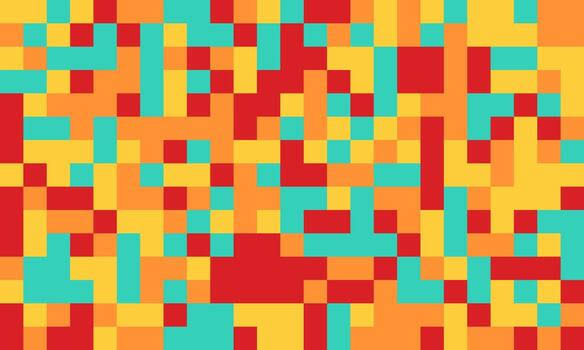
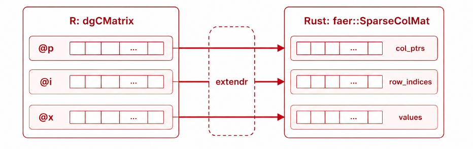
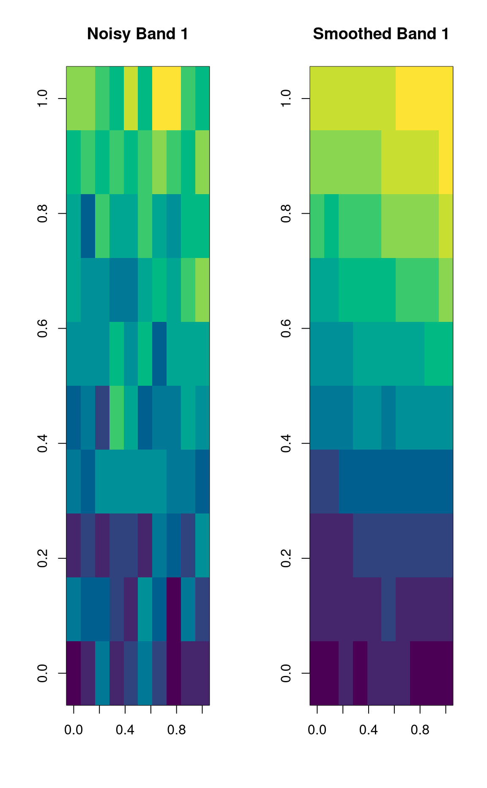

# GSoC Midterm Blog

This blog is a midterm update for my GSoC project, **hyperSpec-HPC: Fast Sparse Spectral Kernels in R and Rust**. The goal of the project is to bring a high-performance Rust backend to the `r-hyperspec` ecosystem, starting with graph-based spatial smoothing for hyperspectral images.

Hyperspectral images can become very large: many pixels, many wavelength bands, and a lot of repeated spatial structure. Pure R implementations are very useful for prototyping and correctness checks, but they can become slow when the image grid grows. This project focuses on moving the computationally heavy sparse graph operations into Rust while keeping the user-facing API natural for R users.

By midterm, the package has a working path from R to Rust and back. It includes the package structure, CI workflows, a pure-R reference implementation, a sparse matrix bridge between R and Rust, Rust-side pixel graph construction, iterative solvers, tests, and an R-level `graphSmooth()` method for `hyperSpec` objects.



## Why graph-based smoothing?

Hyperspectral images naturally have spatial structure. Neighboring pixels often contain related chemical or physical information, so treating each pixel completely independently can throw away useful context. A graph-based approach models each pixel as a node and connects nearby pixels with edges.

This gives us a graph Laplacian:

```text
L = D - W
```

where `W` is the adjacency matrix and `D` is the degree matrix. Spatial smoothing can then be written as a sparse linear system:

```text
(I + alpha L) x = b
```

Here, `b` is the original signal for one wavelength band, `x` is the smoothed output, and `alpha` controls the smoothing strength. Since the same spatial graph is reused across wavelength bands, this is a natural fit for sparse matrix methods and Rust-side acceleration.

Implementation flow of the `graphsmooth()` function:
```{mermaid}
flowchart LR
    HS["hyperSpec object"]
    RW["R wrapper"]
    GC["Rust graph construction"]
    L["Sparse Laplacian"]
    S["CG/BiCGSTAB solver"]
    OUT["Smoothed hyperSpec object"]

    HS --> RW
    RW --> GC
    GC --> L
    L --> S
    HS -. spectral data .-> S
    S --> OUT
```

## The R interface

The package now exposes a high-level S4 method:

```r
graphSmooth(x, width, height, alpha = 1.0, neighbors = 4L,
            backend = c("rust", "r"), solver = c("cg", "bicgstab"))
```

This keeps the user-facing side simple. Users pass a `hyperSpec` object and the spatial dimensions of the image grid. The function returns another `hyperSpec` object with the same metadata and smoothed spectra.

Example usage:

```r
spc_smoothed <- graphSmooth(
  spc_noisy,
  width = 100,
  height = 100,
  alpha = 2.0,
  neighbors = 8,
  backend = "rust",
  solver = "cg"
)
```

There is also a pure-R reference backend, `graph_smooth_r()`. It builds the pixel adjacency matrix, constructs the graph Laplacian, and solves the system using `Matrix::solve()`. This backend is important because it gives a correctness reference for the Rust implementation.

## Bridging R sparse matrices to Rust

One of the central technical challenges in this project is the R-Rust sparse matrix boundary.

In R, sparse matrices from the `Matrix` package are commonly stored as `dgCMatrix` objects. This format uses compressed sparse column storage with three main slots:

- `@p`: column pointers
- `@i`: row indices
- `@x`: non-zero values

Rust does not automatically understand R's S4 sparse matrix representation, so the bridge needs to extract these slots on the R side and reconstruct a sparse matrix on the Rust side. In this repo, the R helper `.dgc_slots()` normalizes supported sparse matrix inputs to a `dgCMatrix` layout and extracts the CSC slots.

On the Rust side, the package uses the `dgcmatrix-faer-bridge` crate to reconstruct a `faer` sparse matrix view safely. As a first end-to-end check, I implemented `sparse_row_sums()`, which sends a sparse matrix from R to Rust, computes row sums after reconstruction, and compares the result against `Matrix::rowSums()`.

This may look like a small function, but it is an important milestone. It proves that sparse matrix data can cross the R-Rust FFI boundary correctly and that validation errors are surfaced back to R rather than causing unsafe behavior.

The tests cover coercion of sparse Matrix inputs to `dgCMatrix`, fixed and random sparse matrices, matrices with empty rows or columns, adjacency matrices built by the package, and malformed sparse slots.



## Building the pixel graph in Rust

Instead of constructing a huge adjacency matrix in R and passing it across the FFI boundary, the Rust kernel reconstructs the pixel graph from only three pieces of information:

- `width`
- `height`
- `neighbors`

The implementation uses `petgraph` to create an undirected pixel graph. Each pixel becomes a node, and edges connect spatial neighbors. The package supports both common connectivity options:

| `neighbors` | Connectivity | Meaning |
| --- | --- | --- |
| `4` | von Neumann neighborhood | horizontal and vertical neighbors |
| `8` | Moore neighborhood | horizontal, vertical, and diagonal neighbors |

This design significantly reduces data transfer between R and Rust. R does not need to allocate and ship a large adjacency matrix. The Rust side can rebuild the graph from compact metadata and then directly assemble the sparse operator it needs.

After building the graph, Rust assembles:

```text
A = I + alpha L
```

directly in compressed sparse column form. Each column contains the diagonal term `1 + alpha * degree(pixel)` and `-alpha` entries for neighboring pixels. This matrix is the actual system solved during smoothing.

The Rust-side tests check that the graph has one node per pixel, edge counts match the expected connectivity formulas, corner/edge/interior pixels have the expected degrees, and the shifted Laplacian has consistent row sums.

## Solving the smoothing system

The smoothing system is:

```text
(I + alpha L) x = b
```

For the standard graph Laplacian used here, `I + alpha L` is symmetric positive-definite when `alpha > 0`, so Conjugate Gradient is the natural default solver. I implemented a Rust CG solver using a small CSC matrix-vector multiplication primitive. The solver starts from `x0 = 0` and iterates until the residual norm reaches the configured tolerance.

I also implemented BiCGSTAB. The current smoothing matrix is symmetric, so CG is preferred, but BiCGSTAB is useful for a more general future case, such as weighted or directed graph operators where the matrix may become non-symmetric.

The Rust backend solves each wavelength band independently:

```text
A x_k = b_k
```

where each column of the spectra matrix is one wavelength band. The current implementation loops band-by-band; parallelization over bands is planned next.

Users can choose the solver from R:

```r
spc_smoothed <- graphSmooth(
  spc_noisy,
  width = 100,
  height = 100,
  alpha = 2.0,
  neighbors = 8,
  backend = "rust",
  solver = "bicgstab"
)
```

The Rust backend is the default backend, with a pure-R fallback if the compiled extension is unavailable or fails. This keeps the package usable in development environments where the Rust toolchain may not be ready yet.

## Testing and validation

Testing has been a major part of the midterm work. The current test coverage is organized around the main pieces of the implementation.

For the R baseline, tests verify:

- correct 4- and 8-connectivity adjacency structure
- Laplacian symmetry and zero row sums
- agreement with a dense reference solve
- `alpha = 0` identity behavior
- preservation of per-band spatial mean
- non-increase of per-band variance after smoothing
- proper return of a `hyperSpec` object

For the sparse bridge, tests verify:

- `dgCMatrix` slot extraction
- compatibility with different sparse Matrix classes
- agreement with `Matrix::rowSums()`
- error handling for malformed sparse inputs

For the Rust solver, tests verify:

- CG agrees with the pure-R reference
- BiCGSTAB agrees with CG and the pure-R reference
- invalid solver names and invalid connectivity are rejected
- the high-level `graphSmooth(backend = "rust")` path returns valid `hyperSpec` objects

There is also a Rust-side test suite for graph construction, shifted Laplacian assembly, and the iterative solvers. This split is useful: R tests validate the user-facing behavior, while Rust tests validate the lower-level numerical kernel.

## Documentation and examples

The package includes a spatial smoothing vignette that demonstrates the intended user workflow:

1. create or load hyperspectral data
2. wrap the spectra in a `hyperSpec` object
3. call `graphSmooth()`
4. compare noisy and smoothed wavelength bands visually

The vignette currently shows a small simulated image and plots a noisy band next to the smoothed result. This is a good starting point, and after benchmarking I plan to expand it with more realistic examples and performance notes.

{width=50%}

## What works now

The most important midterm outcome is that the package now has a complete path from R to Rust and back:

```text
hyperSpec object
  -> spectra matrix
  -> Rust graph construction with petgraph
  -> sparse shifted Laplacian in CSC form
  -> CG / BiCGSTAB solve per wavelength band
  -> smoothed spectra
  -> hyperSpec object
```

The design also avoids passing a full adjacency matrix across the FFI boundary. This is important for scalability. Instead of making R allocate a large sparse graph and then transferring it, Rust reconstructs the graph from the image dimensions and connectivity setting.

## Next steps

The next major task is parallel spectral processing. Each wavelength band solve is independent, so the loop over bands is a natural target for parallelization using Rust's `rayon`. This should improve performance for hyperspectral datasets with many wavelength bands.

After that, I plan to focus on:

- larger integration tests
- benchmarking against the pure-R backend
- documenting performance behavior
- expanding the vignette with clearer examples and plots

The midterm implementation establishes the core architecture: a working R API, a Rust sparse backend, graph construction, Laplacian assembly, and iterative solvers. The second half of the project can now focus on speed, robustness, benchmarking, and user-facing polish.

## Closing thoughts

This first half of the project was mainly about building the hard foundation. The FFI bridge, graph construction, and iterative solvers are the parts where small mistakes can easily lead to incorrect results or fragile code. Getting these pieces working together has been the most important milestone so far.

The package is now able to take a `hyperSpec` object, construct the spatial graph in Rust, solve the Laplacian smoothing system with CG or BiCGSTAB, and return the smoothed result back to R. That completes the planned midterm work and sets up the project well for the performance-focused second half.

